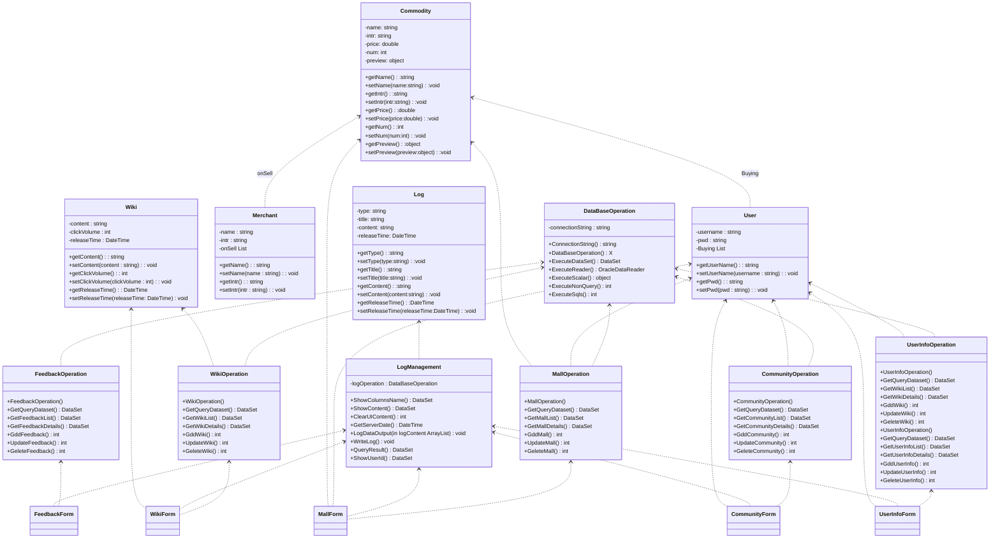

```mermaid
classDiagram
    class DataBaseOperation {
    	-connectionString : string
        +ConnectionString() string
        +DataBaseOperation()X
        +ExecuteDataSet() DataSet
        +ExecuteReader() OracleDataReader
        +ExecuteScalar() object
        +ExecuteNonQuery() int
        +ExecuteSqls() int
    }
    
    class LogManagement {
    	-logOperation : DataBaseOperation 
        +ShowColumnsName() DataSet
        +ShowContent() DataSet
        +ClearUIContent() int
        +GetServerDate() DateTime
        +LogDataOutput(in logContent  ArrayList) void
        +WriteLog() void
        +QueryResult() DataSet
        +ShowUserId() DataSet
    }
    
    class WikiOperation {
        +WikiOperation()
        +GetQueryDataset() DataSet
        +GetWikiList() DataSet
        +GetWikiDetails() DataSet
        +GddWiki() int
        +UpdateWiki() int
        +GeleteWiki() int
    }
    class WikiForm{
   		
    }
    
    
    class UserInfoOperation {
        +UserInfoOperation()
        +GetQueryDataset() DataSet
        +GetWikiList() DataSet
        +GetWikiDetails() DataSet
        +GddWiki() int
        +UpdateWiki() int
        +GeleteWiki() int
    }
    class UserInfoForm{
   		
    }
    
    class UserInfoOperation {
        +UserInfoOperation()
        +GetQueryDataset() DataSet
        +GetUserInfoList() DataSet
        +GetUserInfoDetails() DataSet
        +GddUserInfo() int
        +UpdateUserInfo() int
        +GeleteUserInfo() int
    }
    class UserInfoForm{
   		
    }
    
    
    class CommunityOperation {
        +CommunityOperation()
        +GetQueryDataset() DataSet
        +GetCommunityList() DataSet
        +GetCommunityDetails() DataSet
        +GddCommunity() int
        +UpdateCommunity() int
        +GeleteCommunity() int
    }
    class CommunityForm{
   		
    }
    
    class MallOperation {
        +MallOperation()
        +GetQueryDataset() DataSet
        +GetMallList() DataSet
        +GetMallDetails() DataSet
        +GddMall() int
        +UpdateMall() int
        +GeleteMall() int
    }
    class MallForm{
   		
    }
    
    class FeedbackOperation {
        +FeedbackOperation()
        +GetQueryDataset() DataSet
        +GetFeedbackList() DataSet
        +GetFeedbackDetails() DataSet
        +GddFeedback() int
        +UpdateFeedback() int
        +GeleteFeedback() int
    }
    class FeedbackForm{
   		
    }
    
    
    class Merchant {
        -name : string
        -intr : string
        -onSell List<Commodity>
        +getName() : string
        +setName(name : string) : void
        +getIntr() : string
        +setIntr(intr : string) : void
    }
    class User{
        -username : string
        -pwd : string
        -Buying List<Commodity>
        +getUserName() : string
        +setUserName(username : string) : void
        +getPwd() : string
        +setPwd(pwd : string) : void
    }

    class Wiki{
        -content : string
        -clickVolume : int
        -releaseTime : DateTime
        +getContent() : string
        +setContent(content : string) : void
        +getClickVolume() : int
        +setClickVolume(clickVolume : int) : void
        +getReleaseTime() : DateTime
        +setReleaseTime(releaseTime: DateTime)  void 
    }

    class Commodity{
        -name: string 
        -intr: string 
        -price: double 
        -num: int 
        -preview: object

        +getName():string 
        +setName(name:string):void 
        +getIntr():string 
        +setIntr(intr:string):void 
        +getPrice():double 
        +setPrice(price:double):void 
        +getNum():int 
        +setNum(num:int):void 
        +getPreview():object 
        +setPreview(preview:object):void 

    }

    class Log{
        -type: string 
        -title: string 
        -content: string 
        -releaseTime: DateTime

        +getType():string 
        +setType(type:string):void 

        +getTitle():string 
        +setTitle(title:string):void 

        +getContent():string 
        +setContent(content:string):void 

        +getReleaseTime():DateTime 
        +setReleaseTime(releaseTime:DateTime):void 

    }


    
direction  BT

    LogManagement ..> Log
    
    WikiOperation ..> DataBaseOperation
    WikiForm ..> WikiOperation
    WikiForm ..> LogManagement
    
    UserInfoOperation ..> DataBaseOperation
    UserInfoForm ..> UserInfoOperation
    UserInfoForm ..> LogManagement
    
    CommunityOperation ..> DataBaseOperation
    CommunityForm ..> CommunityOperation
    CommunityForm ..> LogManagement
    
    MallOperation ..> DataBaseOperation
    MallForm ..> MallOperation
    MallForm ..> LogManagement
    
    FeedbackOperation ..> DataBaseOperation
    FeedbackForm ..> FeedbackOperation
    FeedbackForm ..> LogManagement
    
    
    
    Merchant  ..>  Commodity: onSell  
    User  ..>  Commodity: Buying  
    
    
    UserInfoOperation ..> User
    UserInfoForm ..> User
    
    WikiOperation ..> Wiki
    WikiForm ..> Wiki
    
    
    
    MallOperation ..> User
    MallForm ..> User
    MallOperation ..> Commodity
    MallForm ..> Commodity
    
    
    CommunityOperation ..> User
    CommunityForm ..> User
   
    
    
```

```mermaid

```